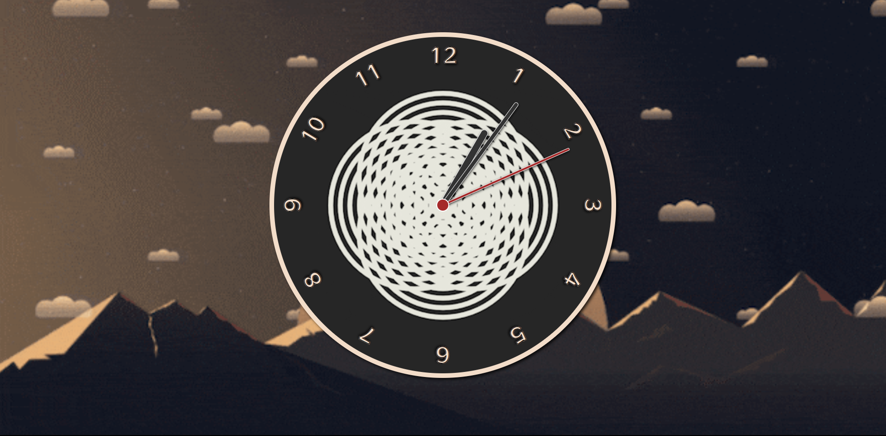

# Clock - Online

Deploy: https://clock-nine-theta.vercel.app/

## Sobre

Se trata de um relógio digital. Adicionei imagens de fundo dinâmicas e o relógio com efeito hover para melhor experiencia do usuário. Consegui deixar adaptado para Mobile, Desktop e Tablet.
### Objetivos

Praticar HTML, CSS e Javascript. É um projeto simples, con intuito de praticar meus conhecimentos de Javascript.

### Desafio

Compreender como funciona o algoritmo do Javascript é importantíssimo, por esse motivo que decidi desenvolver este projeto e foi uma ideia muito acertada, pois consegui adquirir novos conhecimentos.

### Conclusão

Foi um projeto muito interessante de desenvolver. Aprendi coisas novas que com certeza irão contribuir para o meu aprendizado. Planejo ainda adicionar som ao ponteiro de segundos.

### Ferramentas Utilizadas

- HTML
- CSS
- Javascript
